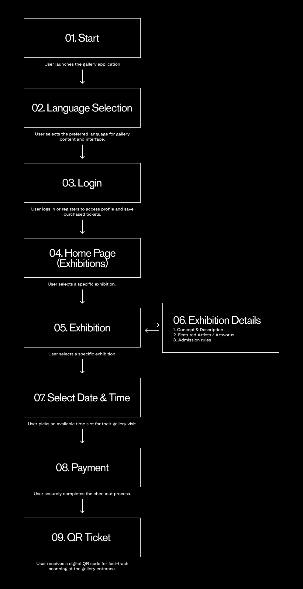
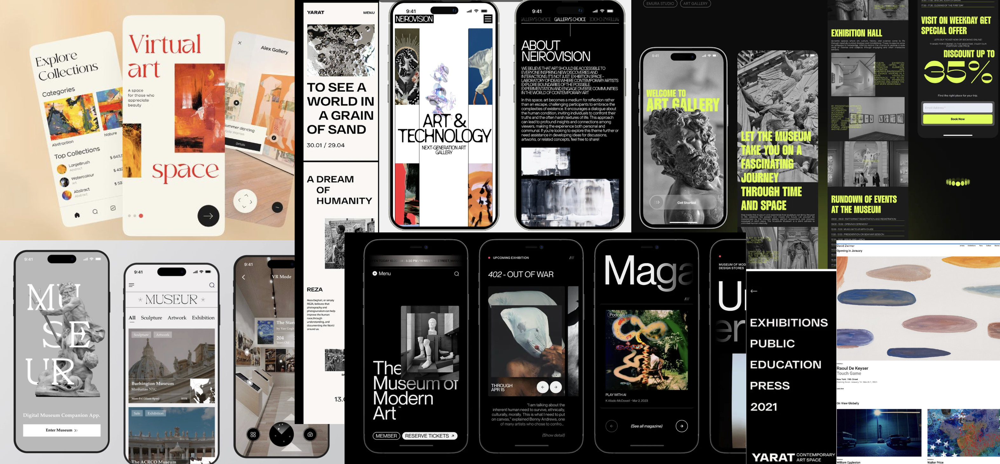
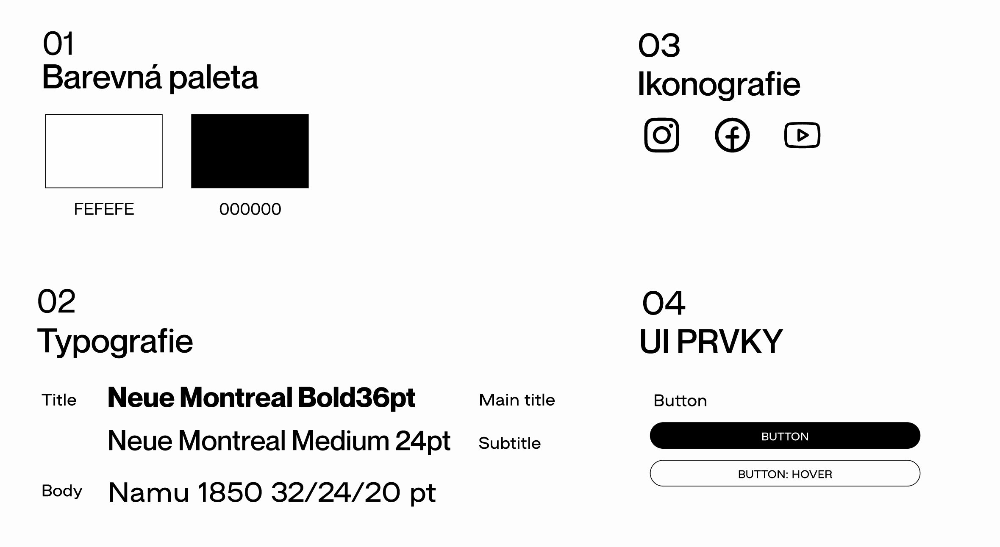
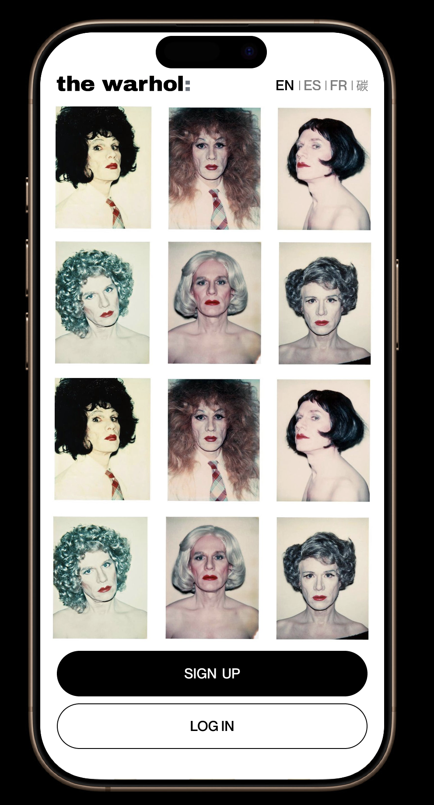
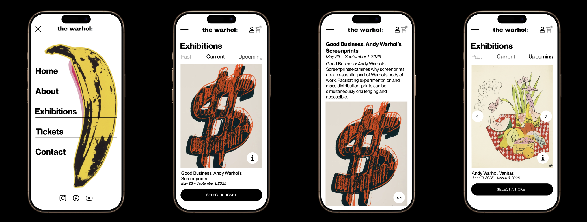
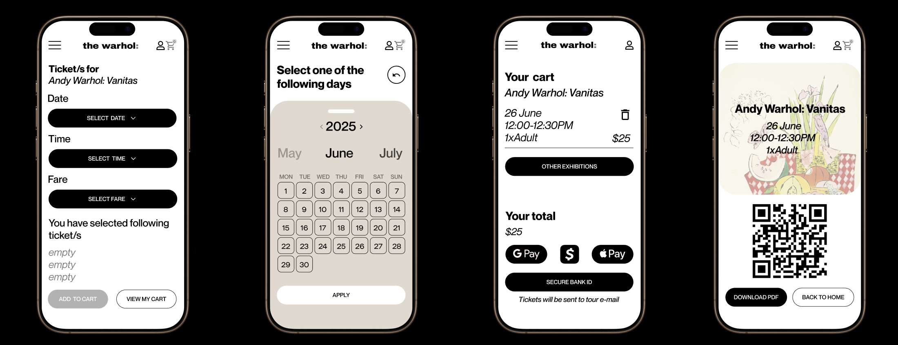

# Case Study: The Andy Warhol museum app

**Year:** 2025 · **Role:** UX/UI Designer

---

## Why museum apps usually fail and what I wanted to do differently

Museum apps are usually an afterthought.
They exist, but nobody actually wants to use them.

For a museum dedicated to Andy Warhol — someone who spent his entire career making art feel accessible — that felt especially wrong.

I set out to fix 3 specific things:

|  | The friction | My approach |
|---|---|---|
| 1 | International visitors landing on a screen that isn't in their language | Language selector as the very first choice |
| 2 | Too many exhibitions with no clear way in | Three tabs: Past · Current · Upcoming |
| 3 | Too many steps between "I want to go" and actually having a ticket | Linear, dead-end-free flow — 8 screens total |

---

## Mapping the whole journey before touching a single screen

The first thing I did wasn't design — it was thinking.

I mapped out every step a visitor would take, from opening the app to holding a QR ticket in their hand. The goal was simple: one direction, no dead ends, no moments of "wait, where do I go now?"

*The full user journey, mapped before any visual decisions were made.*

---

## Looking at what already exists — and where It falls short

Before designing anything, I looked at how other cultural apps handle the same challenges. What works, what feels dated, and where there's an obvious gap.

*Reference apps from cultural institutions around the world. The gap between their visual identity and their app experience was the starting point.*

---

## Black and white — not because it's safe, but because It's right

The color decision came early and it was deliberate.

Warhol's work is loud, layered, and maximal. The app needed to be the opposite — so the art could breathe. A colorful interface would compete with the exhibitions. A monochrome one steps back and lets the content lead.

> "My goal was to make an interface that disappears the moment you stop needing it."

Typography: **Neue Montreal** for headings — neutral and confident. **Namu 1850** for body text — readable at every size.

*The full design system. Two colors, two typefaces, one clear visual direction.*

---

## Building the screens: from first Impression to final ticket

### The First Screen Has One Job: Set the Tone

No welcome message. No tagline. Just a grid of Warhol portraits — instantly recognizable, zero explanation needed. The language selector sits quietly in the corner, visible to anyone who needs it.

*Onboarding and authentication screens. The art does the introducing.*

---

### A Menu That Becomes a Moment

Most hamburger menus open into a list. This one opens into a full-screen overlay with the iconic Warhol banana. Navigation stops being a utility and starts being an experience.

*Home screen and navigation menu. The banana wasn't decorative — it was a design decision.*

---

### Exhibitions: Clear Tabs, Direct Paths

Three tabs keep the content organized without burying anything. Every exhibition card leads directly to ticket selection — no extra steps, no extra pages.

*Exhibition browsing. The tab structure was the answer to decision fatigue.*

---

### Ticket Purchase: One Direction Only

Date → Time → Fare type → Cart. No branching, no going back to find something. The cart is always one tap away.

*The ticket purchase flow. Every step has exactly one next step.*

---

## What Testing Revealed — and What I Changed Because of It

I ran moderated testing with two people, both given the same task:

> *"You want to buy a ticket. Start from the home screen and complete the purchase."*

- **Student, 22** — finished in about 30 seconds. Called it *"super intuitive and fast."* Went straight to the menu without hesitation.
- **Tourist, 45** — finished in about a minute. Spent several seconds on the home screen looking for a way in before finding the menu icon.

That second result was the one that mattered.

The hamburger icon wasn't invisible — but it wasn't obvious enough for someone who wasn't already looking for it. I redesigned the home screen to include a persistent CTA button. One small change. The friction disappeared.

*Testing results. Both users completed the task — but the tourist's hesitation pointed directly at what needed to change.*

---

## What I Learned

Designing for a cultural space is a balancing act.

Too much interface and you're competing with the art. Too little and people can't find what they need. The hardest part wasn't designing the screens — it was deciding what not to put on them.

> The best design decision I made was also the simplest: get out of the way.
